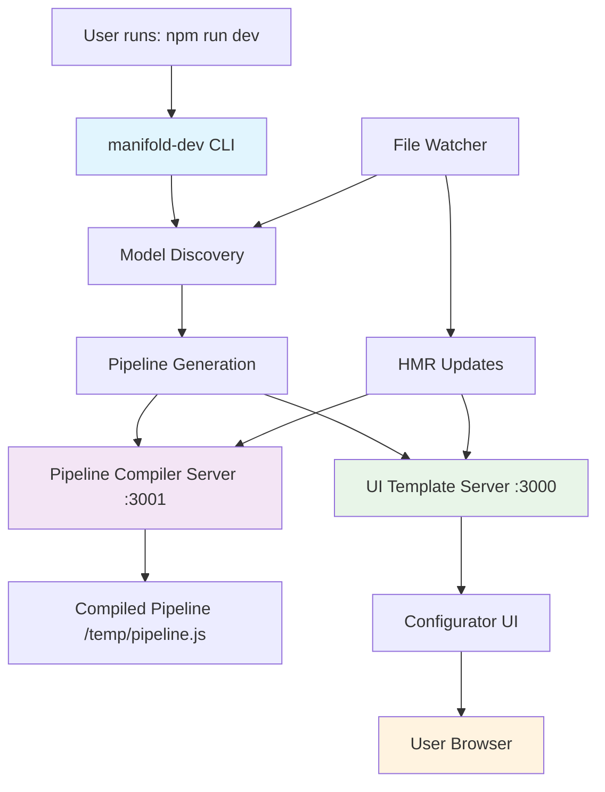

# @manifold-studio/configurator

A library for creating interactive CAD model configurators with CLI integration and automatic model discovery.

## Overview

The configurator package provides a complete UI library for building interactive CAD model configurators. It includes the **Manifold Studio CLI** that handles automatic model discovery, pipeline generation, and dual-server development setup.

## Architecture

This package provides both a **library** and a **CLI tool**:

- **Library**: UI components and configurator functionality for user projects
- **CLI**: Development tool that handles model discovery, pipeline compilation, and server management



### Key Components

**Library Components:**

- **V3Configurator**: Main configurator class that orchestrates the entire system
- **Model Services**: Handle pipeline loading, model generation, and state management
- **UI Components**: Parameter controls, model viewer, and model list
- **HMR Integration**: Hot module replacement for development workflow
- **State Management**: Reactive state system for UI updates

**CLI Components:**

- **Model Discovery**: Automatic detection of .ts model files
- **Pipeline Generation**: Dynamic creation of pipeline entry files
- **Dual Server Management**: Coordinates UI server and pipeline compiler
- **File Watching**: Monitors model files for changes and regenerates pipeline

### Pipeline File Architecture ⚠️ Important Gotcha

The CLI uses a file/route mapping that can be confusing:

- **File on disk**: `temp/user-pipeline-entry.ts` (TypeScript source)
- **Served route**: `/temp/pipeline.js` (compiled JavaScript via Vite middleware)

**Why this matters:**

- File watchers must monitor `temp/user-pipeline-entry.ts` (the actual file)
- HTTP requests go to `/temp/pipeline.js` (the served route)
- The pipeline server transforms TypeScript to JavaScript on-the-fly

This design allows the CLI to serve TypeScript files as JavaScript without requiring a separate build step, but the filename mismatch can be confusing for developers working on CLI internals or testing.

## Development Workflow

### CLI-Based Development

This package **cannot be developed standalone**. Use the CLI development environment:

1. **Navigate to test project**:

   ```bash
   cd test-v3-development
   ```

2. **Start CLI with configurator development mode**:

   ```bash
   npm run dev:v3
   ```

3. **Make changes to configurator source files**:

   - Edit files in `packages/configurator/src/`
   - Changes will be reflected immediately via HMR
   - No build step required during development

4. **View changes in browser**:
   - CLI automatically opens browser to http://localhost:3000
   - Changes to configurator source files trigger automatic updates

### Why CLI-Based Development?

The V3 architecture uses the **Manifold Studio CLI** to coordinate:

- **Automatic model discovery**: Detects .ts files and generates pipeline entries
- **Dual-server management**: Coordinates pipeline compiler (port 3001) + UI server (port 3000)
- **Source-based imports**: No build chain during development with `--configurator-dev-mode`
- **Cross-package HMR**: Hot module replacement works across package boundaries
- **File watching**: Monitors model files and regenerates pipeline automatically

## Building

To build the library for distribution:

```bash
npm run build
```

This creates the distributable library files in `dist/lib/`.

## Testing

Run the test suite:

```bash
npm test          # Run all tests
npm run test:watch # Watch mode
```

## CLI Usage

The configurator includes a CLI tool for development:

```bash
# In a user project directory
node ../packages/configurator/dist/cli/index.js dev --configurator-dev-mode

# Or via npm script (as set up by create-app)
npm run dev
```

## Library Usage

Once built, the configurator can be imported and used in user projects:

```typescript
import { startConfigurator } from "@manifold-studio/configurator";

// Initialize configurator (typically handled by CLI-generated HTML)
await startConfigurator({
  pipelineUrl: "http://localhost:3001/temp/pipeline.js",
  manifestUrl: "http://localhost:3001/temp/manifest.json",
});
```

## Source-Based Development Notes

During development, this package is imported directly from source files using CLI-managed Vite aliases:

```typescript
// CLI automatically configures aliases when using --configurator-dev-mode
resolve: {
  alias: {
    '@manifold-studio/configurator': resolve(userProjectPath, '../packages/configurator/src'),
    '@manifold-studio/wrapper': resolve(userProjectPath, '../packages/wrapper/src')
  }
}
```

This enables:

- ✅ No build step during development
- ✅ TypeScript compilation on-the-fly by Vite
- ✅ HMR across package boundaries
- ✅ Immediate feedback loop
- ✅ Automatic model discovery and pipeline generation

The CLI handles all alias configuration automatically - no manual Vite config needed.
